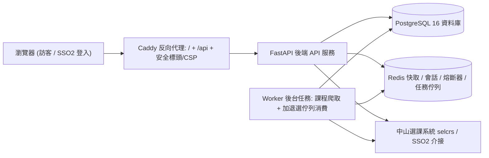

# NSYSU Course Wrapper（中山選課外掛系統）

**繁體中文** | [English (英文)](README_en.md)

---

> [!NOTE]
> 🚀 **網站即將正式上線，敬請期待！**

專為國立中山大學（NSYSU）設計的現代化選課輔助系統。提供流暢的課程檢索、多維度進階篩選、即時週課表排課與衝堂／學分檢查、課程大綱直連、課表 PNG 圖檔匯出，以及校內已選課程同步。在嚴格的**二次確認機制**與高規格資訊安全保障下，支援非同步代理加退選功能。

FastAPI / Vite + React 18 + TypeScript + Bootstrap 5 / PostgreSQL 16 + Redis / Caddy

---

## 目錄 (Table of Contents)

1. [核心特色 (Features)](#核心特色)
2. [系統架構 (Architecture)](#系統架構)
3. [安全與隱私防護 (Security & Privacy)](#安全與隱私防護)
4. [線上部署 (Quickstart)](#線上部署-quickstart)
5. [本機開發 (Local Development)](#本機開發)
6. [測試與驗證 (Testing)](#測試與驗證)
7. [延伸技術文件 (Documentation)](#延伸技術文件)
8. [近期更新亮點 (Recent Highlights)](#近期更新亮點)
9. [致謝與授權 (Attribution & License)](#致謝與授權)

---

## 核心特色

| 權限層級 | 適用對象 | 功能說明 |
|---|---|---|
| **公開瀏覽** | 任何人（免登入） | 課程目錄瀏覽（虛擬滾動支援大量資料流暢載入）、關鍵字搜尋、**多維度進階篩選**（開課學系／年級／學分／必選修／EMI 英語授課／尚有餘額／星期／節次）、課程名稱直通學校官方教學大綱頁面（另開分頁）、雙語介面切換（繁體中文 ⇄ English）。 |
| **排課模擬** | 訪客／免登入 | 本地暫存排課（localStorage）、視覺化週課表預覽、即時衝堂警示、學分與節數自動統計、PNG 高解析度課表圖檔匯出。 |
| **學生專區** | 在學學生（SSO2 認證） | 校內「我的已選」即時同步、暫存清單加退選代送（支援志願序）、送出前表單校對預覽（Preview）與**密碼二次確認防呆機制**、非同步背景工作佇列（Redis Queue + Background Worker）、即時送單紀錄與執行結果追蹤（精確顯示校內反饋如「違反限修條件」，學號自動遮罩脫敏）。 |

---

## 系統架構



- **Caddy (`deploy/`)**：單一對外 HTTP(S) 入口（80/443），負責靜態前端資源託管與 `/api/*` 反向代理，配置嚴格的 CSP（Content Security Policy）與安全標頭。
- **FastAPI 後端 (`backend/app/`)**：
  - **課程檢索**：`/api/courses`（分頁查詢）、`/api/catalog/meta`（資料新鮮度）、`/api/catalog/depts`（學系清單快取 30 分鐘）、`/api/courses/{id}/outline`（教學大綱代理）。
  - **認證與安全性**：`/api/auth/*`（SSO2 登入流、密碼雜湊處理、Session Cookie），內建登入防暴破計數鎖定與校內端點熔斷機制（Circuit Breaker）。
  - **加退選流水線**：`POST /api/write/preview`（送單前校對）→ `POST /api/write/submit`（密碼二次確認與防重送 CSRF Token，排入 Redis 佇列）→ `GET /api/write/jobs*`（執行紀錄追蹤）。
  - **隱私慣例**：非公開／禁止存取之內部端點一律回應 404（而非 401/403），避免端點結構外洩。
- **Worker 服務 (`python -m app.worker`)**：非同步背景執行緒，定期排程爬取最新開課目錄，並專門消化加退選寫入佇列（`writeq:jobs`），確保校內 POST 連線不阻塞 API 核心服務。
- **PostgreSQL 16**：持久化儲存學生紀錄、課程資料庫（包含精確對應之課別代號 `code`）、目錄同步歷史，以及加退選審計紀錄（90 天生命週期後去識別化歸檔）。
- **Redis**：處理 SSO2 站內 Session、極短 TTL 之校內憑證快取、熔斷器狀態、學系清單快取與佇列冪等性（Idempotency）防重保證。
- **React 18 前端 (`frontend/src/`)**：
  - 基於 Bootstrap 5 與自建設計系統 Token，無 Tailwind 依賴。
  - 使用 React Virtuoso 實現大量課程列表虛擬滾動渲染。
  - 整合 `html2canvas` 匯出課表 PNG（內建圖檔完整性檢測）。
  - 模組化排課與衝突偵測邏輯（`lib/timeslots.ts`、`lib/selectionGrid.ts`）。

---

## 安全與隱私防護

1. **零密碼落地（Zero-Credential Storage）**：學生密碼絕不儲存於資料庫中；校內 Session 憑證僅暫存於 Redis 並設置短 TTL 自動過期。
2. **二次確認防呆機制（Human-in-the-Loop Confirmation）**：所有實質加退選請求皆須在主控台進行表單預覽校對，並經由使用者手動二次輸入密碼確認後方可送出。
3. **個資去識別化（PII Protection）**：審計日誌使用加鹽雜湊（Salted Hash）關聯學生身份，前端紀錄頁之學號一律遮罩處理（例如 `M123****78`）。
4. **異常防禦與熔斷機制（Circuit Breaker & Rate Limiting）**：限制單一帳號連續登入失敗次數，並於校內服務不穩定時自動啟動熔斷保護，避免造成校方伺服器負載。
5. **嚴格內容安全政策（Strict CSP）**：全面配置 `script-src 'self'`，杜絕未授權的行內腳本執行風險。

---

## 線上部署 (Quickstart)

```bash
# 1. 複製環境設定檔並設定必要環境變數（如 APP_SECRET）
cp .env.example .env

# 2. 透過 Docker Compose 一鍵構建並啟動所有容器
docker compose -f deploy/docker-compose.yml up --build -d

# 3. 驗證服務狀態
curl -sf http://localhost/api/health        # 健康檢查 (經由 Caddy 入口)
curl -sf http://localhost/                  # 前端主頁
curl -sf http://localhost/api/ops/state     # 熔斷器與系統狀態
```

- **資料庫備份**：執行 `scripts/backup.sh` 可將 PostgreSQL 資料庫以 `pg_dump | gzip` 匯出至 `deploy/backups/`（預設保留最近 14 份）。
- **服務更新**：修改後端路由或資料模型後，建議以 `docker compose up --build -d` 重新部署容器，確保快取與依賴完全一致。

---

## 本機開發

```bash
# 方式 A：Docker 容器環境（支援熱重載）
docker compose -f deploy/docker-compose.yml -f deploy/docker-compose.dev.yml up --build

# 方式 B：本機直接執行
# 後端 (FastAPI)
cd backend && uv python install 3.12 && uv sync && uv run uvicorn app.main:create_app --factory --reload

# 前端 (Vite + React)
cd frontend && npm install && npm run dev   # 開發伺服器會自動將 /api 代理至 localhost:8000
```

- **資料庫遷移**：`docker compose -f deploy/docker-compose.yml exec app alembic upgrade head`
- **型別要求**：前後端皆採嚴格 TypeScript / Python Type Hints 規範，禁止於正式程式碼中使用 `as any`。

---

## 測試與驗證

```bash
# 後端測試 (Pytest)
cd backend && uv run pytest

# 前端測試 (Vitest & TypeScript Check)
cd frontend && npx vitest run
```

- **安全測試原則**：測試與校內介接驗證一律不落地密碼，且絕不異動或影響使用者現有之實際選課內容。

---

## 延伸技術文件

- [`docs/architecture.md`](docs/architecture.md)：系統架構設計規範、機密資料處理政策、寫入管線與 PII 生命週期。
- [`docs/runbook.md`](docs/runbook.md)：系統維運手冊、資料庫備份與還原 SOP、環境變數完整清單。
- [`docs/launch-checklist.md`](docs/launch-checklist.md)：上線前安全審查規範與狀態檢核清單。
- [`docs/verified-facts.md`](docs/verified-facts.md)：校內系統互動行為驗證筆記與錯誤回饋解析規則。

---

## 近期更新亮點

- **全站雙語支援**：前端內建零依賴多語系（i18n）切換機制，可於導航列即時切換繁體中文與英文。
- **即時錯誤反饋**：加退選紀錄頁能精準解析並顯示校方退件原因（如「違反限修條件」），並完善遮罩學號隱私。
- **高相容課表匯出**：課表圖檔匯出引擎改用 `html2canvas`，並加入畫面完整性檢驗，確保產出清晰課表圖片。
- **更精簡的架構**：整合課程瀏覽、即時週課表排課、暫存清單與送單紀錄於單一主控台，提升操作體驗。

---

## 致謝與授權

本專案借鑑與改編自以下開源專案，特此致謝：

- [NSYSU-OpenDev/NSYSUCourseAPI](https://github.com/NSYSU-OpenDev/NSYSUCourseAPI) — 課程目錄欄位解析邏輯
- [NSYSU-OpenDev/NSYSUSelectorHelper](https://github.com/NSYSU-OpenDev/NSYSUSelectorHelper) — 週課表格版配置與節次衝堂運算邏輯
- [edwinchu0711/NsysuApp_OpenSource](https://github.com/edwinchu0711/NsysuApp_OpenSource) — SSO2 登入與選課介接流程參考
- [nsysu-code-club/NSYSU-AP](https://github.com/nsysu-code-club/NSYSU-AP) — SSO2 認證機制參考
- [Hua777/NSYSUSelcrs](https://github.com/Hua777/NSYSUSelcrs) — 選課架構參考
